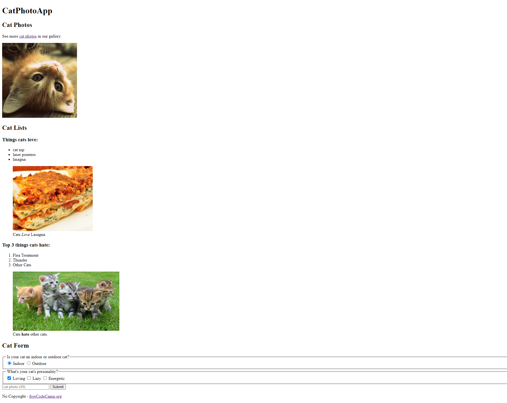

# CatPhotoApp

## Description
HTML tags give a webpage its structure. You can use HTML tags to add photos, buttons, and other elements to your webpage.

In this mini project, I review the most common HTML tags by building my own cat photo app.

## Credits
Kevin Ng